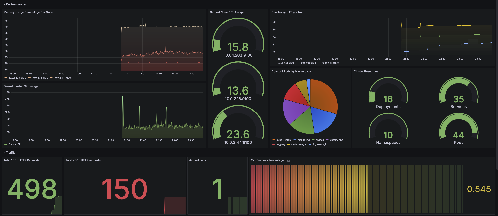
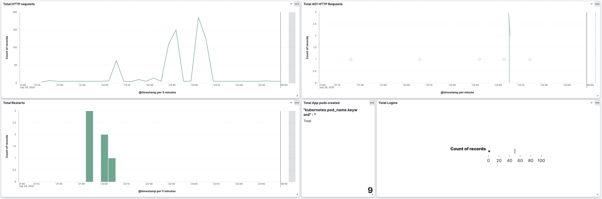

# Spotify Stats GitOps Repository

A production-grade GitOps implementation showcasing a Spotify statistics application with comprehensive observability and monitoring stack deployed on Kubernetes using ArgoCD.

## Architecture

This repository demonstrates a **multi-layered GitOps architecture** using ArgoCD's app-of-apps pattern:

- **Infrastructure Layer**: Nginx Ingress, Cert-Manager, Prometheus/Grafana, ELK Stack
- **Application Layer**: Spotify Stats FastAPI app with MongoDB replica set
- **GitOps Management**: ArgoCD for automated deployment and self-healing

## Technology Stack

| Component | Technology | Purpose |
|-----------|------------|---------|
| **Application** | FastAPI + MongoDB | Spotify stats web application |
| **GitOps** | ArgoCD | Continuous deployment and sync |
| **Ingress** | Nginx Ingress Controller | Load balancing and TLS termination |
| **Monitoring** | Prometheus + Grafana | Metrics collection and visualization |
| **Logging** | Elasticsearch + Fluent Bit | Centralized log aggregation |
| **Security** | Cert-Manager + Let's Encrypt | Automated TLS certificate management |
| **Registry** | Amazon ECR | Private container image storage |

## Quick Start

### Deploy Infrastructure + Application
```bash
# Deploy all components via app-of-apps
kubectl apply -f app-of-apps.yaml
kubectl apply -f spotify-app.yaml

# Check deployment status
argocd app list
```

### Local Development
```bash
# Create Kind cluster and deploy locally
kind create cluster --config kind.conf
cd spotify-stat-helm && helm dependency update
helm install spotify-app . --namespace spotify-app --create-namespace
```

### Access Services
- **Application**: https://your-domain.example.com
- **Grafana**: Port-forward to access monitoring dashboard
- **Kibana**: Port-forward to access logging dashboard

## Production Features

- ✅ **HTTPS with automatic TLS certificates**
- ✅ **MongoDB replica set (3 nodes) with persistence**
- ✅ **Horizontal scaling (3 app replicas)**
- ✅ **Comprehensive monitoring and alerting**
- ✅ **Centralized logging with ELK stack**
- ✅ **GitOps with automated sync and self-healing**

## Monitoring Dashboard



The Grafana dashboard provides real-time metrics for application performance, infrastructure health, and resource utilization.

## Logging Dashboard



Kibana dashboard shows centralized logs from all components with advanced filtering and search capabilities.

## Repository Structure

```
├── app-of-apps.yaml          # ArgoCD root application
├── spotify-app.yaml          # Main application config
├── infra-apps/               # Infrastructure components
├── spotify-stat-helm/        # Helm charts and values
└── kubernetes/               # Raw manifests (reference)
```

## TLDR

This is a **production-ready GitOps repository** that deploys a Spotify statistics application with full observability stack. It demonstrates:

- **App-of-Apps GitOps pattern** for managing complex deployments
- **Production-grade infrastructure** with monitoring, logging, and security
- **Automated TLS certificate management** and ingress configuration
- **Multi-environment support** with Helm value overrides

Perfect for showcasing modern cloud-native application deployment patterns and GitOps best practices.