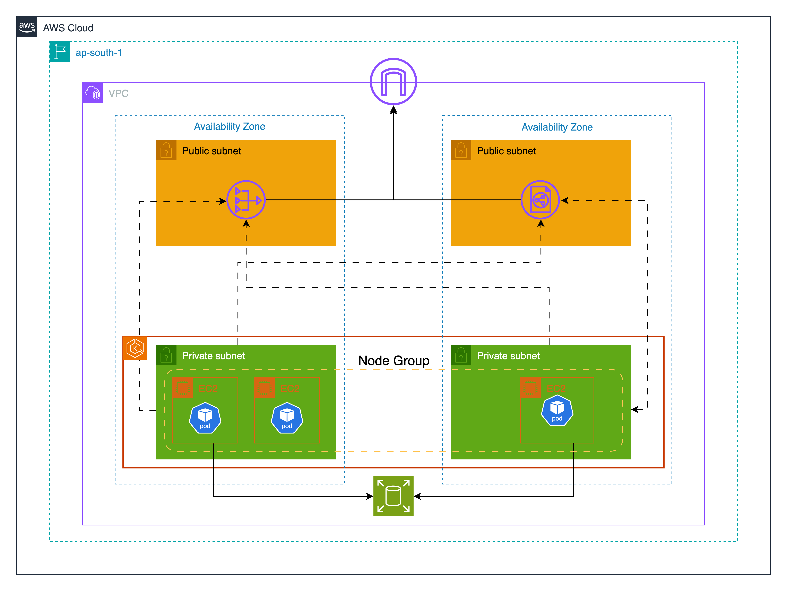

# Spotify Stats Infrastructure

AWS EKS infrastructure with GitOps deployment for the Spotify Statistics application using Terraform and ArgoCD.

## Architecture



The infrastructure deploys a complete EKS cluster across multiple availability zones with:
- **Multi-AZ EKS Cluster** with high availability across multiple zones
- **Private/Public Subnet Architecture** with NAT Gateway
- **ArgoCD GitOps Deployment** with SSH authentication
- **AWS Secrets Manager Integration** for sensitive data

## Directory Structure

```
├── modules/
│   ├── network/          # VPC, subnets, security groups
│   ├── eks/              # EKS cluster, node groups, IAM roles
│   └── argocd/           # ArgoCD deployment and configuration
├── docs/
│   ├── AWS_SECRETS_SETUP.md
│   └── SSH_SETUP.md
├── deploy.sh             # Automated deployment script
├── destroy.sh            # Safe infrastructure cleanup
├── debug-ssh.sh          # SSH connectivity debugging
└── terraform configuration files
```

## Infrastructure Modules

### Network Module
- VPC with public/private subnets
- Internet Gateway and NAT Gateway
- Security groups for cluster, nodes, and ALB
- Kubernetes-compatible resource tagging

### EKS Module
- EKS cluster (Kubernetes 1.30)
- Managed node groups (t3a.medium instances)
- Essential add-ons (VPC CNI, CoreDNS, kube-proxy, EBS CSI)
- IAM roles and policies

### ArgoCD Module
- ArgoCD Helm deployment
- GitOps repository integration
- SSH key authentication setup
- Application of applications pattern

## Quick Start

### Prerequisites
- AWS CLI configured with appropriate permissions
- Required secrets in AWS Secrets Manager (see [docs/](docs/))

### Deploy Infrastructure
```bash
./deploy.sh
```

### Access ArgoCD
```bash
kubectl port-forward svc/argocd-server -n argocd 8080:443
```

### Cleanup
```bash
./destroy.sh
```

## Configuration

Key settings in `terraform.tfvars`:
- **Region**: us-west-2 (configurable)
- **Cluster**: saar-spotify-cluster
- **Nodes**: 2-3 t3a.medium instances
- **GitOps**: spotify-stats-gitops repository

## Documentation

- **[AWS Secrets Setup](docs/AWS_SECRETS_SETUP.md)** - Configure Spotify API and SSH secrets
- **[SSH Setup](docs/SSH_SETUP.md)** - GitOps repository SSH access
- **[CLAUDE.md](CLAUDE.md)** - Detailed development guide

## Useful Commands

```bash
# Configure kubectl access
aws eks update-kubeconfig --region us-west-2 --name spotify-app-cluster

# Get ArgoCD admin password
kubectl -n argocd get secret argocd-initial-admin-secret -o jsonpath="{.data.password}" | base64 -d

# Check applications
kubectl get applications -n argocd

# Debug SSH connectivity
./debug-ssh.sh
```